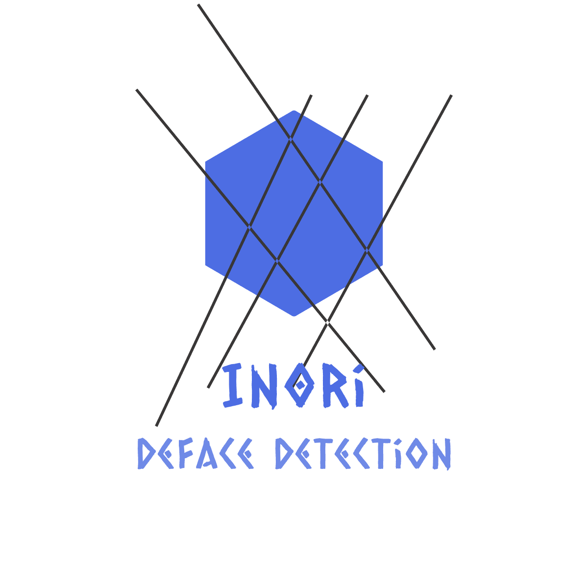

      

In0ri is a defacement detection system utilizing a image-classification convolutional neural network.

## Introduction
When monitoring a website, In0ri will periodically take a screenshot of the website then put it through a preprocessor that will resize the image down to 250x250px and numericalize the image before passing it onto the classifier. The core of the classifier is a convolutional neural network that is trained to detect the defacement of a website. If the monitored website is indeed, defaced, In0ri will send out warnings via email to the user.

## Requirement
* Python3 (version >=3.6)
* Docker
* Docker-compose

## Installation

### Cloning the repository

```sh
git clone https://github.com/J4FSec/In0ri.git
cd In0ri
```

### Docker

You can also use In0ri via the official Docker container  [here](https://hub.docker.com/repository/docker/in0ri/defaced).

### Starting In0ri

```sh
docker-compose up -d
```
After running the In0ri, open an Internet browser to `https://<serverIP>:8080/` to show WebUI.

### Configuring email credentials to send notifications and agent keys from

Going to the WebUI and click tab "Setting" then select tag "Email" to configure email server.

```py
Mail Server = "mail.example.com"
Username = "foo@gmail.com"
Password = "$uper$ecurePa$$word"
```

### Configure Telegram notification

Going to the WebUI and click tab "Setting" then select tag "Telegram" to configure Channel notifications on Telegram.

```py
Chat ID= 'foo' # Channel ID to send notifications to
Token = 'bar' # Bot token retrieved from @BotFather
```

## Usage

There are two ways to deploy and using In0ri:
* Running off crontab by periodically visiting the url.
* Internal agent running off the web server

### First Method: URL Check

Visit the Dashboard tab on WebUI, click on "Add URLs" then fill in the form and submit it.

### Second Method: Internal Agent

At the table listing all urls which were registered on WebUI, click on "Create Key" button at column Actions, the Active Key will send to your email or click "Details" button to show it.

On the web server that you wants to be monitored by In0ri, download the Agent folder from Github repository

Installing the required packages for the internal Agent

```sh
python3 -m pip install watchdog
python3 -m pip install requests
```

Edit the file `config.json` in the same folder as agent

```sh
nano config.json
```

A `key` is sent to your email after registering the Agent on the WebUI
`rootPath` is the root directory of the web application that you want to be monitored
`exludePath` are the subfolders that you wants excluded from the scans
`apiServer` is the URL to the API server of In0ri
`serverIP` is the IP of the API server of In0ri

```json
{
    "id":"01",
    "key":"123123123",
    "rootPath":"/var/www/html",
    "excludePath":"",
    "apiServer":"http://<serverIP>:8088/checkdeface"
}
```

And run the Agent:

```sh
python3 agent.py
```
## References

* Model training is handled by [Shu](https://github.com/J4FSec/Shu)
* Mentioned by [Kitploit](https://www.kitploit.com/2021/07/in0ri-defacement-detection-with-deep.html)

## Authors

In0ri is built by Echidna with the help of Cu64 and Klone.

## Contributing
Pull requests are welcome. For major changes, please open an issue first to discuss what you would like to change.

## License
[GNU AGPLv3](https://choosealicense.com/licenses/agpl-3.0/)
